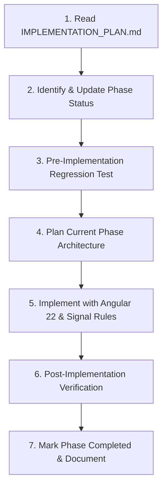

# RestaurantOS Dashboard — Agent Rules & Engineering Workflow

This file defines mandatory operational rules and workflow protocols for any AI agent or developer working on the `Apple-Food-Dashboard` repository.

---

## 🚨 MANDATORY PHASE-BASED IMPLEMENTATION PROTOCOL

Every agent working on this repository **MUST** strictly follow this 7-step lifecycle for all tasks:



### Step 1: Read Implementation Plan First
- **Action**: Before writing, editing, or scaffolding any code, the agent **MUST** read `IMPLEMENTATION_PLAN.md` at the project root.
- **Goal**: Understand current project progress, completed milestones, active phase scope, and architectural constraints.

### Step 2: Check & Update Phase Breakdown Status First
- **Action**: Inspect the **Phase Breakdown** table in `IMPLEMENTATION_PLAN.md`.
- Identify the current phase to be implemented.
- Update its status indicator in `IMPLEMENTATION_PLAN.md` to `🔄 In Progress`.
- Ensure all previously finished phases are verified and marked `✅ Completed`.

### Step 3: Pre-Implementation Regression Testing
- **Action**: Before introducing new changes for the current phase, verify that all prior phases compile and work cleanly.
- Execute:
  ```bash
  npm run build
  ```
- If any regressions or broken builds exist from prior phases, **FIX THEM FIRST** before writing new features.

### Step 4: Plan Current Phase Architecture
- **Action**: Produce a clear, phase-specific plan before writing code.
- Define:
  - Components, services, and models to be created/updated.
  - Angular 22 signal architecture (`signal`, `computed`, `input`, `output`, `httpResource`).
  - Backend API endpoints to connect (`/api/v1/...`).
  - Light/Dark theme tokens (semantic classes only).
  - Responsive & accessibility considerations.

### Step 5: Implement Strictly to Project Standards
- **Framework**: Angular 22 standalone components, OnPush change detection default.
- **State**: Pure Angular Signals + `httpResource` (no RxJS Observables where signals are idiomatic).
- **Backend Data Rule**: **NO MOCK OR STATIC DATA IN VIEWS.** In every phase, make sure all data displayed in screens comes directly from the live backend API.
- **Tenant Context Rule**: **`tenantId` IS MANDATORY.** The `tenantId` (returned upon login with `tenantSlug`, `email`, `password`) must be saved in storage/state and sent via `X-Tenant-Id` header with every backend query to fetch tenant-scoped data.
- **Styling**: Tailwind CSS v4 via `@theme` tokens.
  - **Rule**: NEVER hardcode raw arbitrary hex color classes (e.g. `bg-[#131412]`). ALWAYS use semantic classes: `bg-background`, `bg-surface`, `bg-surface-container`, `bg-surface-hover`, `border-border`, `text-text-primary`, `text-text-secondary`, `text-text-muted`.
- **Theme**: Both Light and Dark (Pro-Service Workspace palette) must work seamlessly.
- **Component Inputs**: Use signal inputs `input<T>()` and signal queries `viewChild<T>()`.

### Step 6: Post-Implementation Verification & Testing
- **Action**: After completing the phase implementation, run full verification:
  ```bash
  npm run build
  ```
  - Verify build produces 0 errors and 0 warnings.
  - Verify route navigation, RBAC permissions, and live backend communication.

### Step 7: Update Implementation Tracker & Documentation
- **Action**: Update `IMPLEMENTATION_PLAN.md`:
  - Mark the completed phase as `✅ Completed` in the Phase Breakdown table.
  - Document all created/modified files, newly added capabilities, and verification outputs.
  - Set the next upcoming phase ready for the next iteration.

---

## 🛠️ Code Conventions & Tech Stack Rules

1. **Dashboard Target Audience**:
   - The dashboard is built specifically for **Owner**, **Manager**, **Cashier**, and **Kitchen** staff (NOT Super Admin).
   - Staff login payload:
     ```json
     {
       "tenantSlug": "apple-food",
       "email": "owner@apple.eg",
       "password": "..."
     }
     ```

2. **Tenant ID Management**:
   - On successful login, save the returned `user.tenantId` into `localStorage` and `AuthService.tenantId`.
   - `auth.interceptor.ts` automatically attaches `X-Tenant-Id: <tenantId>` on all subsequent API requests.
   - All feature modules (Orders, Menu, Tables, Reports, Employees, Branches) must scope their API calls with this `tenantId`.

3. **Strict Live Backend Data**:
   - **Backend Base URL**: `https://restaurant-saas-platform-backend.vercel.app/api/v1`
   - Every view must fetch and display real data from the backend. Handle loading spinners and empty states gracefully.

4. **Angular 22 Signals**:
   - Signal inputs: `readonly prop = input<string>('');` (not `@Input()`)
   - Signal outputs: `readonly propChange = output<string>();` (not `@Output()`)
   - Reactive computeds: `readonly computedVal = computed(() => ...);`
   - Async HTTP: use `httpResource` or signals for data streams.

5. **UI & Styling**:
   - Tailwind CSS v4 CSS-first theming (`src/styles.css`).
   - Material Symbols Outlined and Lucide icons via `<app-icon name="..." customClass="...">`.
